# Splitwise Clone — Low-Level Design (LLD) Document

---

## 1. System Overview

This application is a **Splitwise clone** — a group expense-splitting platform that allows users to create groups, add
expenses, split costs using different strategies, track balances, and compute simplified settlements.

| Layer        | Technology                   | Port             |
|--------------|------------------------------|------------------|
| **Frontend** | React 18 + TypeScript + Vite | `localhost:5173` |
| **Backend**  | Play Framework 2.x (Java)    | `localhost:9000` |
| **ORM**      | Ebean ORM 12.16.1            | —                |
| **Database** | MySQL 8.0                    | `localhost:3306` |
| **DI**       | Google Guice                 | —                |

---

## 2. High-Level Architecture

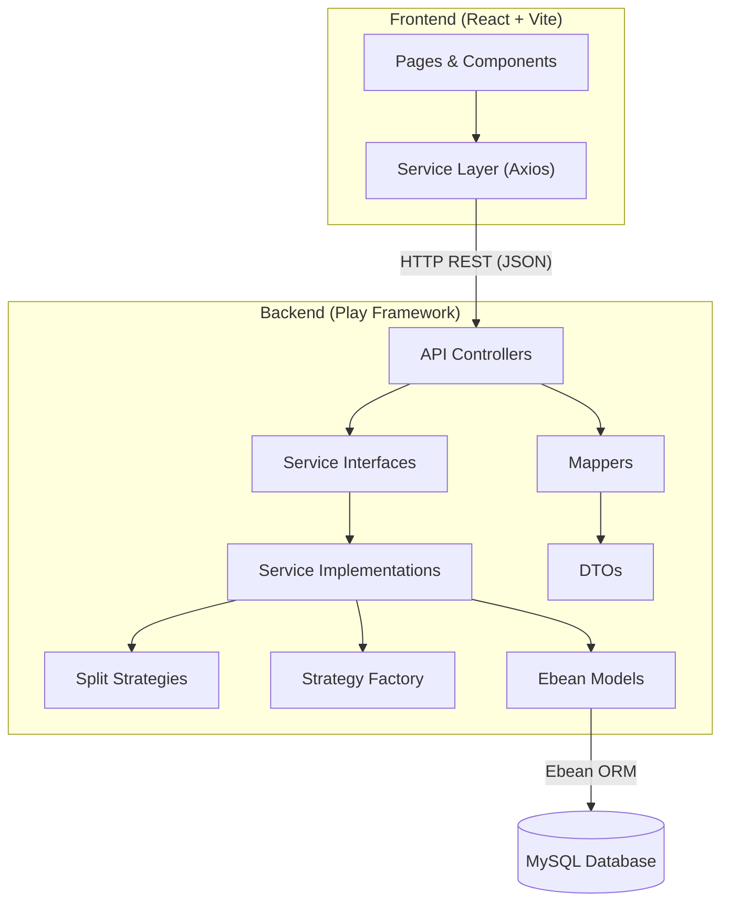

---

## 3. Design Patterns Used

| Pattern                  | Where                                                                                                                                                                                                                                                                                                                                                                                                                                                  | Purpose                                                                                            |
|--------------------------|--------------------------------------------------------------------------------------------------------------------------------------------------------------------------------------------------------------------------------------------------------------------------------------------------------------------------------------------------------------------------------------------------------------------------------------------------------|----------------------------------------------------------------------------------------------------|
| **Strategy Pattern**     | [SplitStrategy](file:///Users/0867s02032sarvesh/splitwise_clone/app/strategies/SplitStrategy.java), [EqualSplitStrategy](file:///Users/0867s02032sarvesh/splitwise_clone/app/strategies/EqualSplitStrategy.java), [ExactSplitStrategy](file:///Users/0867s02032sarvesh/splitwise_clone/app/strategies/ExactSplitStrategy.java), [PercentageSplitStrategy](file:///Users/0867s02032sarvesh/splitwise_clone/app/strategies/PercentageSplitStrategy.java) | Dynamically select expense-splitting algorithm at runtime                                          |
| **Factory Pattern**      | [SplitStrategyFactory](file:///Users/0867s02032sarvesh/splitwise_clone/app/factories/SplitStrategyFactory.java)                                                                                                                                                                                                                                                                                                                                        | Instantiate the correct `SplitStrategy` based on `SplitType` enum                                  |
| **DTO Pattern**          | [dto package](file:///Users/0867s02032sarvesh/splitwise_clone/app/dto) (13 classes)                                                                                                                                                                                                                                                                                                                                                                    | Decouple API response/request shapes from internal entity models                                   |
| **Mapper Pattern**       | [mapper package](file:///Users/0867s02032sarvesh/splitwise_clone/app/mapper) (5 classes)                                                                                                                                                                                                                                                                                                                                                               | Convert between Entity ↔ DTO without polluting models                                              |
| **Template Method**      | [BaseServiceImpl](file:///Users/0867s02032sarvesh/splitwise_clone/app/serviceimpl/BaseServiceImpl.java)                                                                                                                                                                                                                                                                                                                                                | Provide generic CRUD (`save`, `findById`, `findAll`, `update`, `delete`) inherited by all services |
| **Dependency Injection** | [Module](file:///Users/0867s02032sarvesh/splitwise_clone/app/Module.java) (Guice)                                                                                                                                                                                                                                                                                                                                                                      | Bind interfaces to implementations, enabling loose coupling                                        |
| **Service-Repository**   | Service interfaces + Ebean `Finder`                                                                                                                                                                                                                                                                                                                                                                                                                    | Business logic separated from data access via Ebean finders                                        |

---

## 4. Database Schema (ER Diagram)

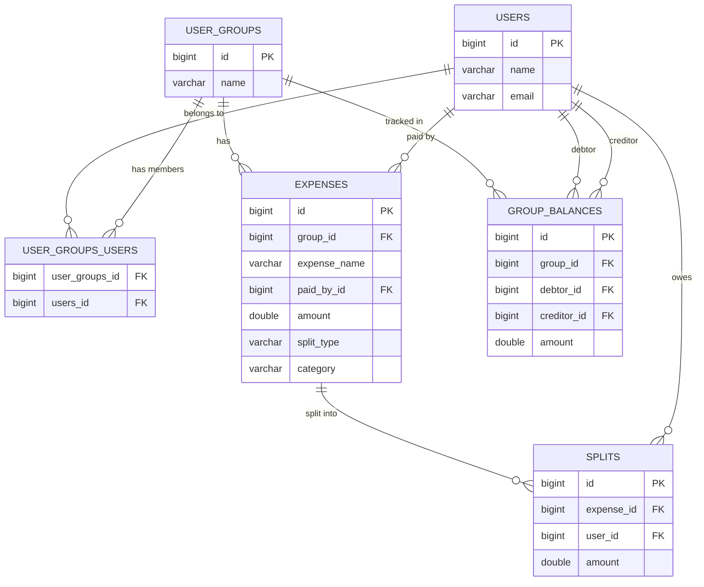

### Table Details

| Table               | Description                                                               | Key Constraints                                                 |
|---------------------|---------------------------------------------------------------------------|-----------------------------------------------------------------|
| `users`             | Registered users                                                          | PK: `id` (auto-increment)                                       |
| `user_groups`       | Expense groups (named `user_groups` to avoid MySQL `GROUP` keyword clash) | PK: `id`                                                        |
| `user_groups_users` | Many-to-many join table for group membership                              | Composite PK: (`user_groups_id`, `users_id`), FK to both tables |
| `expenses`          | Individual expense records within a group                                 | FK: `group_id` → `user_groups`, `paid_by_id` → `users`          |
| `splits`            | Per-user split amounts for each expense                                   | FK: `expense_id` → `expenses`, `user_id` → `users`              |
| `group_balances`    | Pairwise debtor-creditor balances within a group                          | FK: `group_id`, `debtor_id`, `creditor_id` → respective tables  |

> [!NOTE]
> The `Settlement` model is **not persisted** — it is a transient in-memory POJO computed on-the-fly from `GroupBalance`
> records using a greedy algorithm.

---

## 5. Class Diagrams

### 5.1 Entity Models

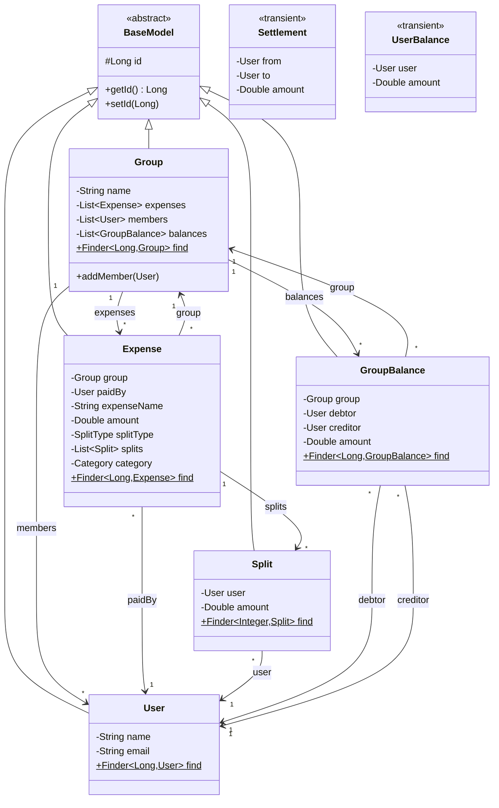

### 5.2 Service Layer

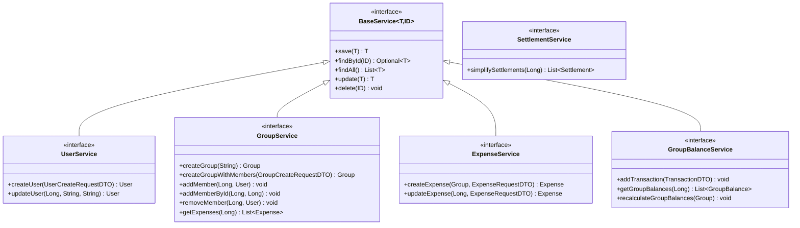

### 5.3 Strategy Pattern

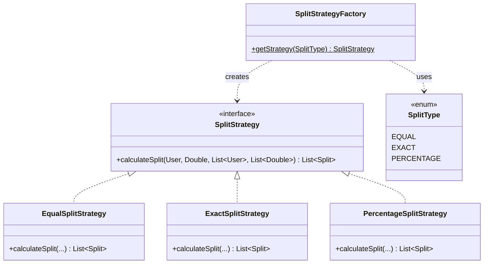

---

## 6. Dependency Injection (Guice Bindings)

Defined in [Module.java](file:///Users/0867s02032sarvesh/splitwise_clone/app/Module.java):

| Interface             | Bound To                  |
|-----------------------|---------------------------|
| `UserService`         | `UserServiceImpl`         |
| `GroupService`        | `GroupServiceImpl`        |
| `ExpenseService`      | `ExpenseServiceImpl`      |
| `GroupBalanceService` | `GroupBalanceServiceImpl` |
| `SettlementService`   | `SettlementServiceImpl`   |

### Injection Graph

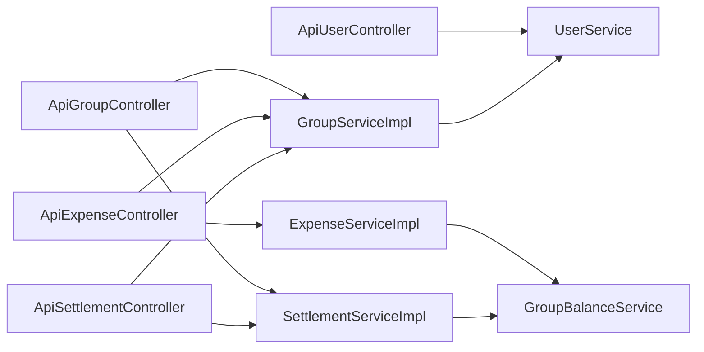

---

## 7. REST API Specification

All routes defined in [routes](file:///Users/0867s02032sarvesh/splitwise_clone/conf/routes).

### 7.1 User APIs

| Method | Endpoint     | Controller Method                | Request Body           | Response        |
|--------|--------------|----------------------------------|------------------------|-----------------|
| `GET`  | `/api/users` | `ApiUserController.getUsers()`   | —                      | `List<UserDTO>` |
| `POST` | `/api/users` | `ApiUserController.createUser()` | `UserCreateRequestDTO` | `UserDTO` (201) |

### 7.2 Group APIs

| Method   | Endpoint                        | Controller Method                     | Request Body            | Response           |
|----------|---------------------------------|---------------------------------------|-------------------------|--------------------|
| `GET`    | `/api/groups`                   | `ApiGroupController.getGroups()`      | —                       | `List<GroupDTO>`   |
| `POST`   | `/api/groups`                   | `ApiGroupController.createGroup()`    | `GroupCreateRequestDTO` | `GroupDTO` (201)   |
| `GET`    | `/api/groups/:id`               | `ApiGroupController.getGroupById()`   | —                       | `GroupDTO`         |
| `GET`    | `/api/groups/:id/detail`        | `ApiGroupController.getGroupDetail()` | —                       | `GroupDetailDTO`   |
| `POST`   | `/api/groups/:id/members`       | `ApiGroupController.addMember()`      | `AddMemberRequestDTO`   | `"Member added"`   |
| `DELETE` | `/api/groups/:id`               | `ApiGroupController.deleteGroup()`    | —                       | `"Group deleted"`  |
| `GET`    | `/api/groups/:groupId/expenses` | `ApiGroupController.getExpenses()`    | —                       | `List<ExpenseDTO>` |

### 7.3 Expense APIs

| Method   | Endpoint                            | Controller Method                       | Request Body        | Response            |
|----------|-------------------------------------|-----------------------------------------|---------------------|---------------------|
| `GET`    | `/api/expenses/:id`                 | `ApiExpenseController.getExpenseById()` | —                   | `ExpenseDetailDTO`  |
| `POST`   | `/api/groups/:groupId/expenses`     | `ApiExpenseController.createExpense()`  | `ExpenseRequestDTO` | `ExpenseDTO` (201)  |
| `PUT`    | `/api/groups/:groupId/expenses/:id` | `ApiExpenseController.updateExpense()`  | `ExpenseRequestDTO` | `ExpenseDTO`        |
| `DELETE` | `/api/groups/:groupId/expenses/:id` | `ApiExpenseController.deleteExpense()`  | —                   | `"Expense deleted"` |

### 7.4 Settlement APIs

| Method | Endpoint                           | Controller Method                          | Request Body | Response              |
|--------|------------------------------------|--------------------------------------------|--------------|-----------------------|
| `GET`  | `/api/groups/:groupId/settlements` | `ApiSettlementController.getSettlements()` | —            | `List<SettlementDTO>` |

---

## 8. DTO Structure & Data Shapes

### Request DTOs

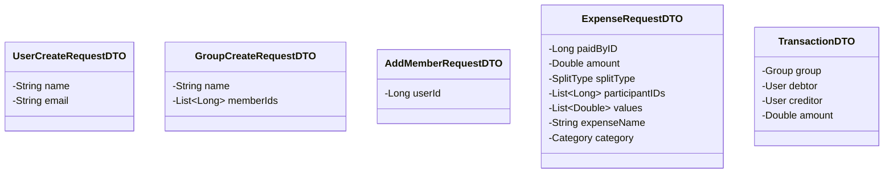

### Response DTOs

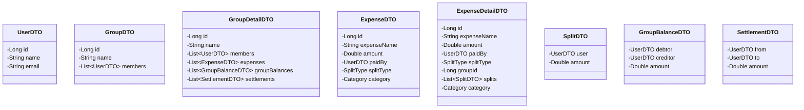

---

## 9. Detailed Data Flow for Each Operation

### 9.1 Create User

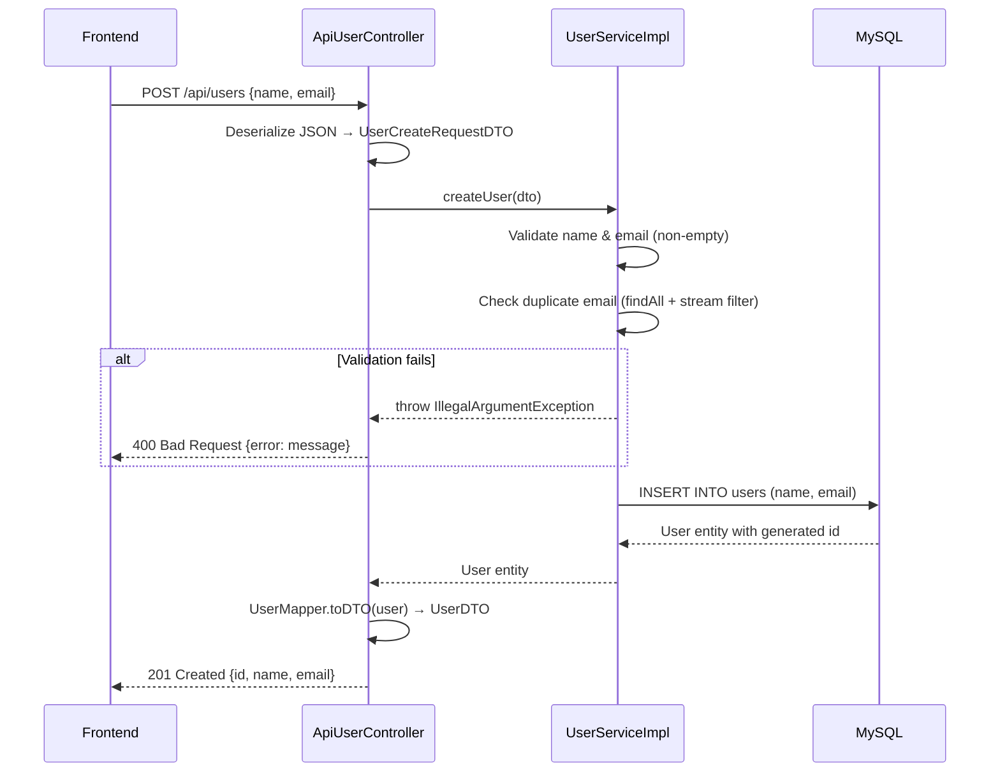

**Key Logic in
** [UserServiceImpl.createUser()](file:///Users/0867s02032sarvesh/splitwise_clone/app/serviceimpl/UserServiceImpl.java#L17-L40):

1. Trim and validate `name` and `email` — throws `IllegalArgumentException` if blank
2. Check for duplicate email via `findAll().stream().anyMatch(...)` — throws if duplicate
3. Create `User` entity → `save()` → return

---

### 9.2 Create Group with Members

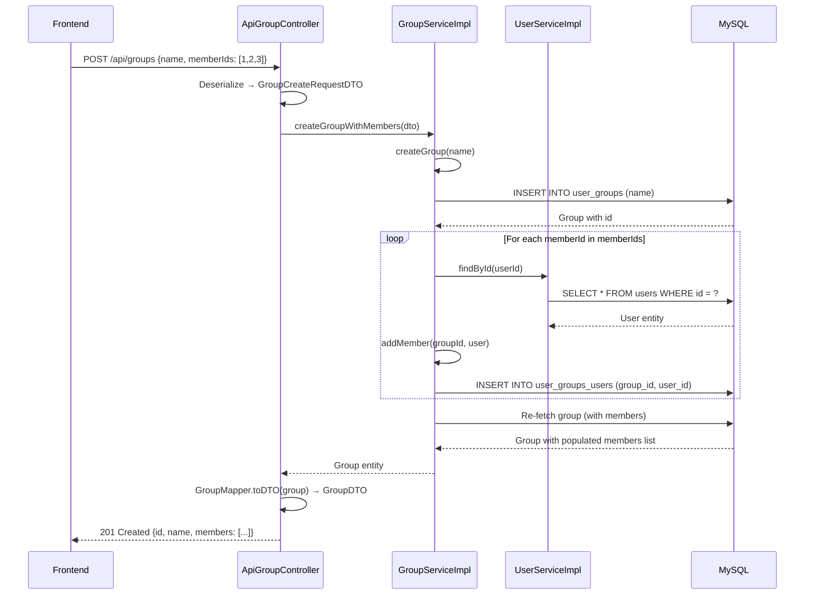

**Key Logic in
** [GroupServiceImpl.createGroupWithMembers()](file:///Users/0867s02032sarvesh/splitwise_clone/app/serviceimpl/GroupServiceImpl.java#L34-L49):

1. Create the group row first
2. Iterate over `memberIds`, look up each user, skip nulls
3. Call `addMember()` which loads group by ID, appends user to `members` list, saves
4. Re-fetch group to populate lazy-loaded members for the response

---

### 9.3 Add Member to Existing Group

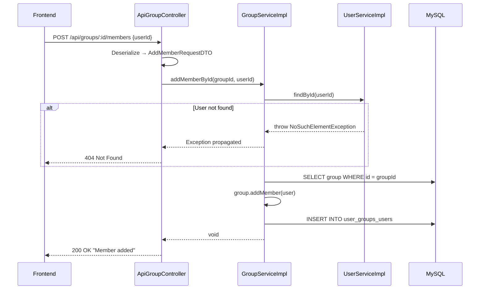

---

### 9.4 Create Expense (Core Operation) ⭐

This is the most complex operation, involving the **Strategy Pattern** and **balance recalculation**.

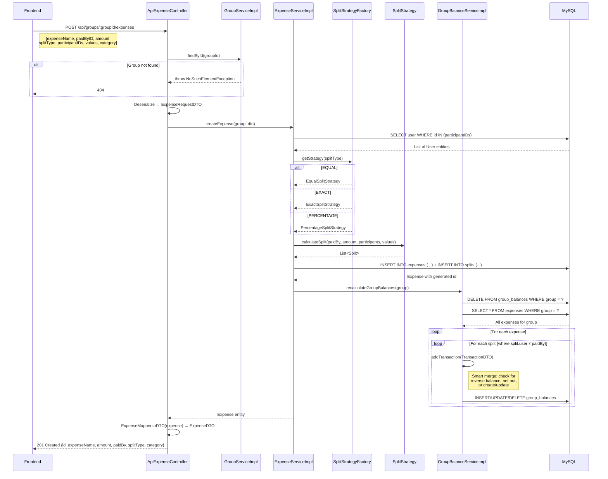

#### Split Calculation Details

| Strategy       | Algorithm                                                                                   | Validation                            |
|----------------|---------------------------------------------------------------------------------------------|---------------------------------------|
| **EQUAL**      | `splitAmount = amount / participants.size()`. Payer's split = `0.0`, others = `splitAmount` | None                                  |
| **EXACT**      | Each participant gets their specified exact `values[i]`. Payer's split = `0.0`              | Sum of values must equal `amount`     |
| **PERCENTAGE** | Each participant gets `amount × percentages[i] / 100`                                       | Sum of percentages must equal `100.0` |

> [!IMPORTANT]
> In **EqualSplitStrategy** and **ExactSplitStrategy**, the payer's split amount is set to `0.0` (they don't owe
> themselves). In **PercentageSplitStrategy**, the payer's split is **not** zero'd out — they get their percentage
> share.

#### Balance Recalculation Algorithm

In [GroupBalanceServiceImpl.recalculateGroupBalances()](file:///Users/0867s02032sarvesh/splitwise_clone/app/serviceimpl/GroupBalanceServiceImpl.java#L66-L86):

1. **Delete** all existing `GroupBalance` records for the group
2. **Re-scan** every expense in the group
3. For each expense, for each split where `split.user ≠ paidBy`:
    - Create a `TransactionDTO(group, debtor=split.user, creditor=paidBy, amount=split.amount)`
    - Call `addTransaction()`

The [addTransaction()](file:///Users/0867s02032sarvesh/splitwise_clone/app/serviceimpl/GroupBalanceServiceImpl.java#L21-L53)
method performs **smart net-off logic**:

```
if reverse balance exists (creditor↔debtor swapped):
    if reverse.amount > transaction.amount:
        reverse.amount -= transaction.amount     // reduce reverse
    elif reverse.amount == transaction.amount:
        DELETE reverse                            // they cancel out
    else:
        DELETE reverse
        CREATE new balance with (transaction.amount - reverse.amount)
else:
    if same-direction balance exists:
        balance.amount += transaction.amount      // accumulate
    else:
        CREATE new GroupBalance                   // first debt
```

---

### 9.5 Update Expense

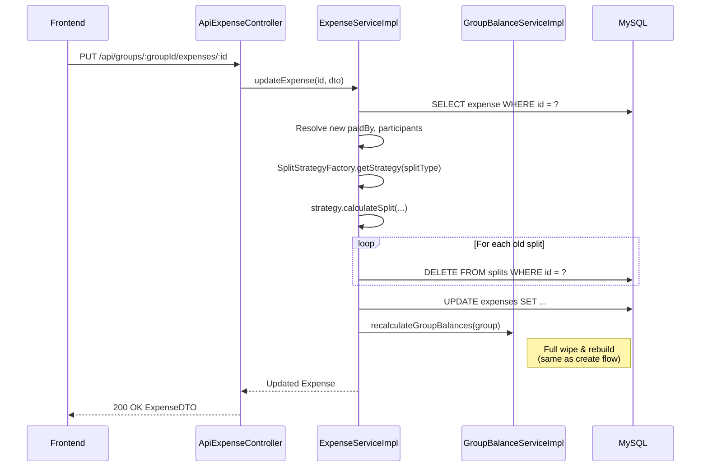

**Key Logic in
** [ExpenseServiceImpl.updateExpense()](file:///Users/0867s02032sarvesh/splitwise_clone/app/serviceimpl/ExpenseServiceImpl.java#L56-L89):

1. Find existing expense by ID
2. Delete all old `Split` entities individually
3. Recalculate new splits using the (possibly new) strategy
4. Update expense fields → `expense.update()`
5. Trigger full `recalculateGroupBalances()` for the group

---

### 9.6 Delete Expense

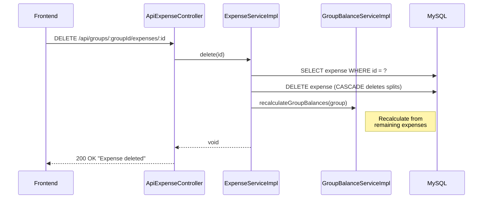

---

### 9.7 Get Group Detail (Composite Query)

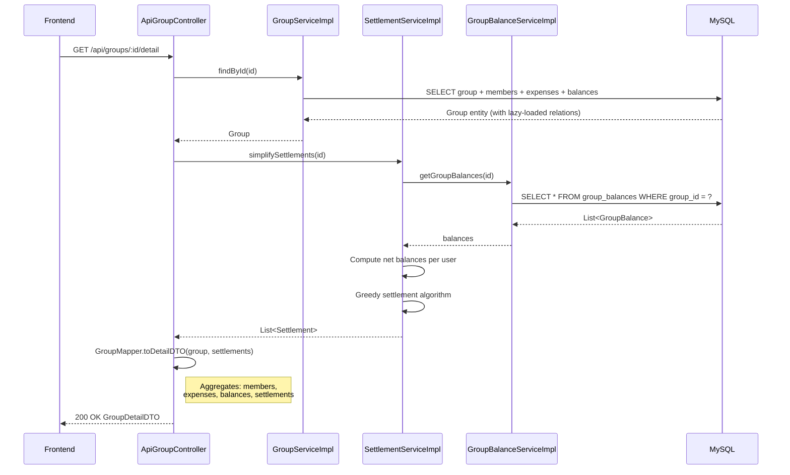

---

### 9.8 Get Simplified Settlements (Algorithm Deep-Dive)

The settlement simplification
in [SettlementServiceImpl.simplifySettlements()](file:///Users/0867s02032sarvesh/splitwise_clone/app/serviceimpl/SettlementServiceImpl.java#L25-L72)
uses a **greedy algorithm with max-heaps**:

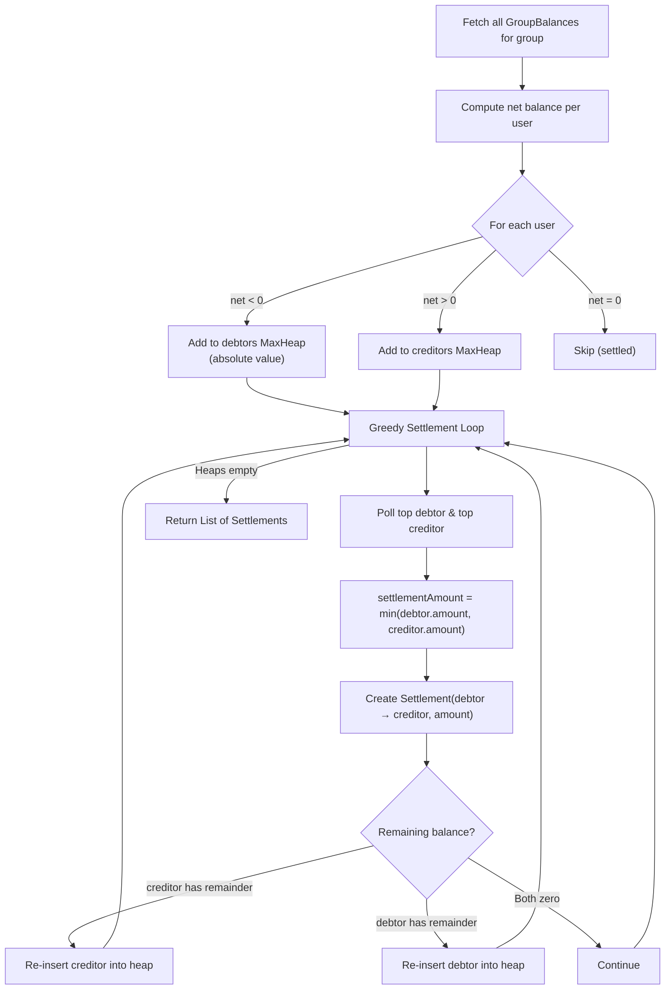

**Algorithm Steps:**

1. **Net balances**: For each `GroupBalance(debtor, creditor, amount)`:
    - `netBalance[debtor] -= amount`
    - `netBalance[creditor] += amount`
2. **Partition**: Users with negative net → debtors heap (max by absolute value), positive → creditors heap
3. **Greedy match**: Pair the largest debtor with the largest creditor, settle `min(debt, credit)`, re-insert remainder
4. This minimizes the number of transactions needed

---

### 9.9 Delete Group

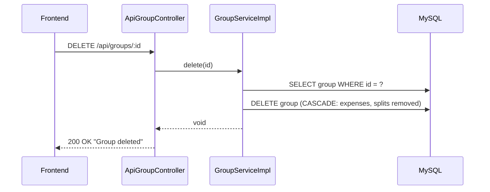

---

## 10. Error Handling

The custom [ErrorHandler](file:///Users/0867s02032sarvesh/splitwise_clone/app/controllers/api/ErrorHandler.java)
implements `HttpErrorHandler` and provides consistent JSON error responses:

| Exception Type             | HTTP Status                   | Response Body                              |
|----------------------------|-------------------------------|--------------------------------------------|
| `IllegalArgumentException` | **400** Bad Request           | `{"error": "<message>"}`                   |
| `NoSuchElementException`   | **404** Not Found             | `{"error": "<message>"}`                   |
| Any other `Throwable`      | **500** Internal Server Error | `{"error": "Internal server error"}`       |
| Client errors (4xx)        | Original status code          | `{"error": "<message>", "status": <code>}` |

> [!NOTE]
> The handler unwraps `CompletionException` (one level) to find the root cause, since Play Framework wraps exceptions in
`CompletionStage`.

---

## 11. Frontend Architecture

### 11.1 Routing

Defined in [App.tsx](file:///Users/0867s02032sarvesh/splitwise_clone/frontend/src/App.tsx):

| Route           | Page Component      | Purpose                                           |
|-----------------|---------------------|---------------------------------------------------|
| `/`             | `DashboardPage`     | Overview/landing page                             |
| `/groups`       | `GroupsPage`        | List all groups                                   |
| `/groups/:id`   | `GroupDetailPage`   | Group detail with expenses, balances, settlements |
| `/expenses/:id` | `ExpenseDetailPage` | Individual expense detail with splits             |
| `/users`        | `UsersPage`         | User management                                   |

### 11.2 Component Hierarchy

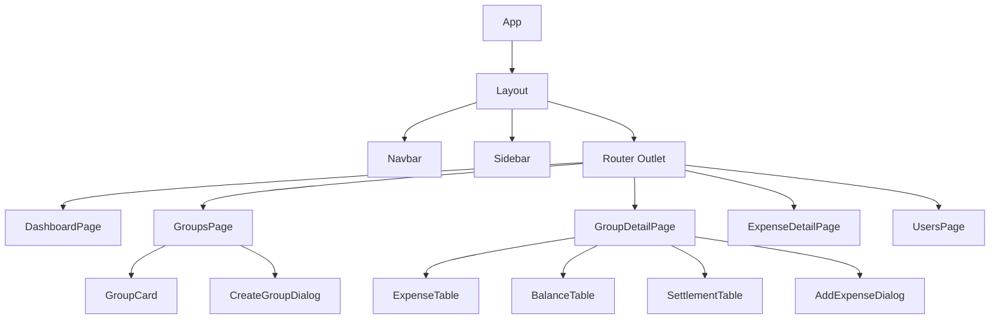

### 11.3 Frontend → Backend Data Flow

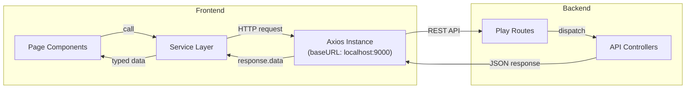

### 11.4 Frontend Type System

TypeScript interfaces mirror the backend DTOs:

| Frontend Type   | Backend DTO        |
|-----------------|--------------------|
| `User`          | `UserDTO`          |
| `Group`         | `GroupDTO`         |
| `GroupDetail`   | `GroupDetailDTO`   |
| `Expense`       | `ExpenseDTO`       |
| `ExpenseDetail` | `ExpenseDetailDTO` |
| `GroupBalance`  | `GroupBalanceDTO`  |
| `Settlement`    | `SettlementDTO`    |
| `Split`         | `SplitDTO`         |

---

## 12. Data Transformation Pipeline

For every API response, data flows through a consistent transformation pipeline:

```
Entity (Ebean Model)
    ↓ Mapper.toDTO()
DTO (Data Transfer Object)
    ↓ Json.toJson()
JSON String
    ↓ HTTP Response
Frontend Axios
    ↓ response.data
TypeScript Interface
    ↓ React State
UI Render
```

### Mapper Responsibilities

| Mapper                                                                                                   | From           | To                                | Notes                                                                                          |
|----------------------------------------------------------------------------------------------------------|----------------|-----------------------------------|------------------------------------------------------------------------------------------------|
| [UserMapper](file:///Users/0867s02032sarvesh/splitwise_clone/app/mapper/UserMapper.java)                 | `User`         | `UserDTO`                         | Direct field copy                                                                              |
| [GroupMapper](file:///Users/0867s02032sarvesh/splitwise_clone/app/mapper/GroupMapper.java)               | `Group`        | `GroupDTO` / `GroupDetailDTO`     | Maps members via `UserMapper`, expenses via `ExpenseMapper`, balances via `GroupBalanceMapper` |
| [ExpenseMapper](file:///Users/0867s02032sarvesh/splitwise_clone/app/mapper/ExpenseMapper.java)           | `Expense`      | `ExpenseDTO` / `ExpenseDetailDTO` | `toDetailDTO` includes splits and groupId                                                      |
| [GroupBalanceMapper](file:///Users/0867s02032sarvesh/splitwise_clone/app/mapper/GroupBalanceMapper.java) | `GroupBalance` | `GroupBalanceDTO`                 | Maps nested debtor/creditor via `UserMapper`                                                   |
| [SettlementMapper](file:///Users/0867s02032sarvesh/splitwise_clone/app/mapper/SettlementMapper.java)     | `Settlement`   | `SettlementDTO`                   | Maps nested from/to via `UserMapper`                                                           |

---

## 13. Enumerations

### SplitType ([SplitType.java](file:///Users/0867s02032sarvesh/splitwise_clone/app/enums/SplitType.java))

| Value        | Description                                      |
|--------------|--------------------------------------------------|
| `EQUAL`      | Split equally among all participants             |
| `EXACT`      | Each participant's exact amount is specified     |
| `PERCENTAGE` | Each participant's percentage share is specified |

### Category ([Category.java](file:///Users/0867s02032sarvesh/splitwise_clone/app/enums/Category.java))

| Value             |
|-------------------|
| `FOOD`            |
| `TRAVEL`          |
| `RENT`            |
| `UTILITIES`       |
| `ENTERTAINMENT`   |
| `OTHER` (default) |

---

## 14. Database Evolutions

Managed via Play Evolutions with `autoApply=true`:

| Evolution | Changes                                                         | File                                                                                   |
|-----------|-----------------------------------------------------------------|----------------------------------------------------------------------------------------|
| **1**     | Create `users`, `user_groups`, `user_groups_users` (join table) | [1.sql](file:///Users/0867s02032sarvesh/splitwise_clone/conf/evolutions/default/1.sql) |
| **2**     | Create `expenses` and `splits` tables with FK constraints       | [2.sql](file:///Users/0867s02032sarvesh/splitwise_clone/conf/evolutions/default/2.sql) |
| **3**     | Create `group_balances` table (debtor-creditor pairs)           | [3.sql](file:///Users/0867s02032sarvesh/splitwise_clone/conf/evolutions/default/3.sql) |
| **4**     | Add `category` column to `expenses` (default `'OTHER'`)         | [4.sql](file:///Users/0867s02032sarvesh/splitwise_clone/conf/evolutions/default/4.sql) |

---

## 15. CORS & Security Configuration

Defined in [application.conf](file:///Users/0867s02032sarvesh/splitwise_clone/conf/application.conf):

| Setting         | Value                                    |
|-----------------|------------------------------------------|
| Allowed Origins | `http://localhost:5173`                  |
| Allowed Methods | `GET, POST, PUT, DELETE, PATCH, OPTIONS` |
| Allowed Headers | `Accept, Content-Type, Authorization`    |
| Credentials     | `true`                                   |
| CSRF            | **Disabled** (`CSRFFilter` removed)      |

---

## 16. Complete End-to-End Example: Adding a ₹900 Dinner Expense Split Equally Among 3 Users

```
1. Frontend: User clicks "Add Expense" on Group Detail page
   → AddExpenseDialog opens

2. User fills form:
   - Expense Name: "Dinner"
   - Amount: 900
   - Paid By: User A (id=1)
   - Split Type: EQUAL
   - Participants: User A (id=1), User B (id=2), User C (id=3)
   - Category: FOOD

3. Frontend → POST /api/groups/1/expenses
   Body: {
     "expenseName": "Dinner",
     "paidByID": 1,
     "amount": 900,
     "splitType": "EQUAL",
     "participantIDs": [1, 2, 3],
     "values": [],
     "category": "FOOD"
   }

4. ApiExpenseController: Validate group exists → call ExpenseServiceImpl

5. ExpenseServiceImpl:
   a. Lookup User A (paidBy), Users A/B/C (participants)
   b. SplitStrategyFactory.getStrategy(EQUAL) → EqualSplitStrategy
   c. EqualSplitStrategy.calculateSplit():
      - splitAmount = 900 / 3 = 300
      - Split(UserA, 0.0)   ← payer, owes nothing to self
      - Split(UserB, 300.0)  ← owes ₹300
      - Split(UserC, 300.0)  ← owes ₹300
   d. Save Expense + 3 Split records
   e. Trigger recalculateGroupBalances(group)

6. GroupBalanceServiceImpl.recalculateGroupBalances():
   a. DELETE all existing GroupBalances for this group
   b. Re-scan all expenses:
      - For Dinner: skip UserA split (amount=0), process:
        - TransactionDTO(debtor=UserB, creditor=UserA, amount=300)
        - TransactionDTO(debtor=UserC, creditor=UserA, amount=300)
   c. addTransaction results:
      - GroupBalance(debtor=UserB, creditor=UserA, amount=300) → SAVED
      - GroupBalance(debtor=UserC, creditor=UserA, amount=300) → SAVED

7. Response → 201 Created with ExpenseDTO

8. Frontend: GroupDetailPage reloads, showing:
   - Expense: "Dinner - ₹900 (paid by User A, EQUAL)"
   - Balances: "User B owes User A ₹300", "User C owes User A ₹300"
   - Settlements: "User B → User A: ₹300", "User C → User A: ₹300"
```

---

## 17. File Structure Summary

```
splitwise_clone/
├── app/
│   ├── Module.java                          # Guice DI bindings
│   ├── controllers/api/
│   │   ├── ApiUserController.java           # User CRUD endpoints
│   │   ├── ApiGroupController.java          # Group management + detail
│   │   ├── ApiExpenseController.java        # Expense CRUD endpoints
│   │   ├── ApiSettlementController.java     # Settlement computation endpoint
│   │   └── ErrorHandler.java               # Global JSON error handler
│   ├── dto/                                 # 13 Data Transfer Objects
│   ├── enums/
│   │   ├── SplitType.java                   # EQUAL | EXACT | PERCENTAGE
│   │   └── Category.java                   # FOOD | TRAVEL | RENT | ...
│   ├── factories/
│   │   └── SplitStrategyFactory.java        # Factory for split strategies
│   ├── mapper/                              # 5 Entity→DTO mappers
│   ├── models/
│   │   ├── BaseModel.java                   # Abstract base with id
│   │   ├── User.java                        # @Entity → users
│   │   ├── Group.java                       # @Entity → user_groups
│   │   ├── Expense.java                     # @Entity → expenses
│   │   ├── Split.java                       # @Entity → splits
│   │   ├── GroupBalance.java                # @Entity → group_balances
│   │   ├── Settlement.java                  # Transient POJO (not persisted)
│   │   └── UserBalance.java                 # Transient POJO for settlements
│   ├── services/                            # 6 Service interfaces
│   ├── serviceimpl/                         # 6 Service implementations
│   └── strategies/
│       ├── SplitStrategy.java               # Strategy interface
│       ├── EqualSplitStrategy.java          # amount / n
│       ├── ExactSplitStrategy.java          # user-specified amounts
│       └── PercentageSplitStrategy.java     # percentage-based
├── conf/
│   ├── application.conf                     # DB, CORS, filters config
│   ├── routes                               # API route definitions
│   └── evolutions/default/                  # 4 SQL evolution scripts
├── frontend/src/
│   ├── App.tsx                              # Router setup
│   ├── components/                          # 9 React components + ui/
│   ├── pages/                               # 5 page components
│   ├── services/                            # 5 API service modules
│   └── types/                               # 8 TypeScript interfaces
└── build.sbt                                # SBT build with PlayJava + Ebean
```
